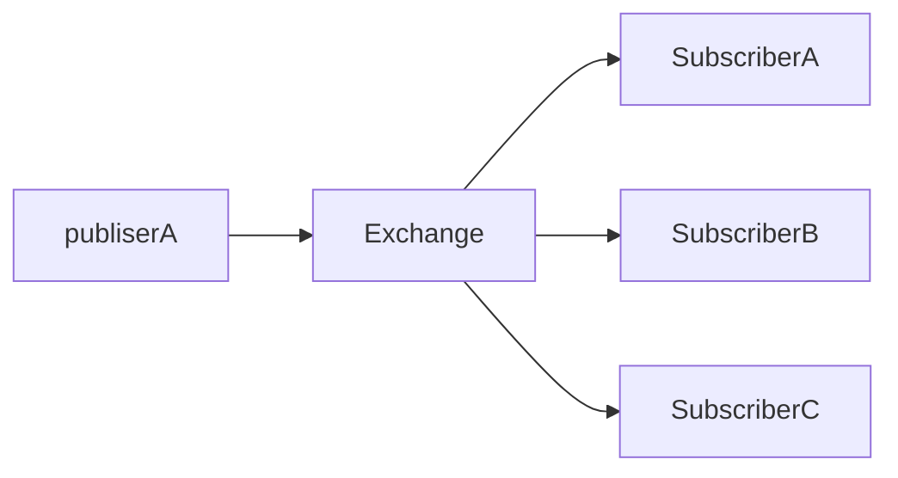

# Publish Subscribe

On multiple shells, execute:

    make run-subscriber

So we create several subscriber which receive the same message.

Then, on other shell, execute:

    make run-publisher

Which publish a message. This message is shown in the all running subscribers.

## References

* https://www.rabbitmq.com/tutorials/tutorial-three-python
