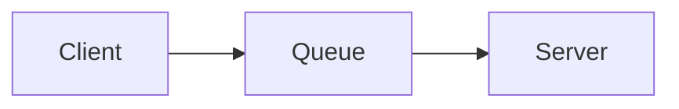

# RPC

This schema is simple, but the code is probably the most complex.

## Schema

## Running

Run the server

    make run-rpc-server

and then, run the client:

    make run-rpc-client

## References

* https://www.rabbitmq.com/tutorials/tutorial-six-python
