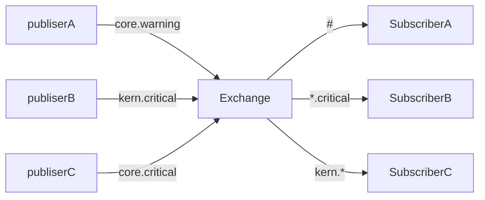

# Topics

This is getting complex. Now, the topology seems this:

## Schema

## Running

So we need 3 subscribers and 3 publishers, eoch of them in its own shell:

    make run-topics-subscriber-all
    make run-topics-subscriber-critical
    make run-topics-subscriber-kern
    make run-topics-publisher-core-warning
    make run-topics-publisher-kern-critical
    make run-topics-publisher-core-critical

## References

* https://www.rabbitmq.com/tutorials/tutorial-five-python
